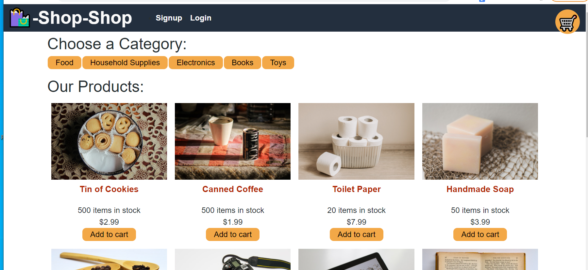

# Redux-store

  ## Description
  This is an application based around an online store, and e-commerce platform. It is a platform that uses Redux to manage global state instead of the Context API.

  

  Here is a link to the app: https://redux-store-ecommerce.herokuapp.com/

  ## Table of Contents
  * [Description](#Description)
  * [Installation](#Installation)
  * [Usage](#Usage)
  * [License](#license)
  * [Contributing](#Contributing)
  * [Questions](#Questions)

 
  ## Installation
  Download the github repo.

  ## Usage
  First implement npm install. Then to start the program, type "npm init" into terminal.
  Type 'npm start' into the command line in order

  
  ## License 
  ISC:
  https://opensource.org/licenses/ISC
  

  Copyright© [2021] [augustinandrea] 

      Permission to use, copy, modify, and/or distribute this software for any purpose with or without fee is hereby granted, provided that the above copyright notice and this permission notice appear in all copies.

      THE SOFTWARE IS PROVIDED "AS IS" AND THE AUTHOR DISCLAIMS ALL WARRANTIES WITH REGARD TO THIS SOFTWARE INCLUDING ALL IMPLIED WARRANTIES OF MERCHANTABILITY AND FITNESS. IN NO EVENT SHALL THE AUTHOR BE LIABLE FOR ANY SPECIAL, DIRECT, INDIRECT, OR CONSEQUENTIAL DAMAGES OR ANY DAMAGES WHATSOEVER RESULTING FROM LOSS OF USE, DATA OR PROFITS, WHETHER IN AN ACTION OF CONTRACT, NEGLIGENCE OR OTHER TORTIOUS ACTION, ARISING OUT OF OR IN CONNECTION WITH THE USE OR PERFORMANCE OF THIS SOFTWARE.      
        

  ## Contributing
  Andrea Augustin
  
  ## Questions
  Contact me through email.

  **GitHub**: [@augustinandrea](https://github.com/augustinandrea)
  

  **Email**: augustin.andrea@gmail.com
